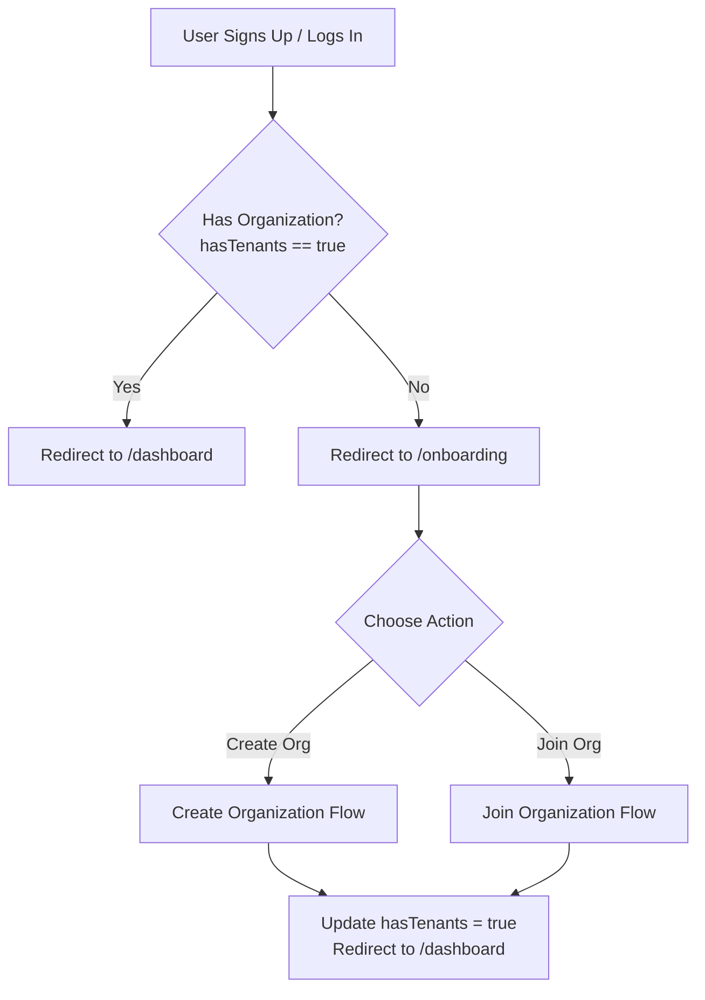
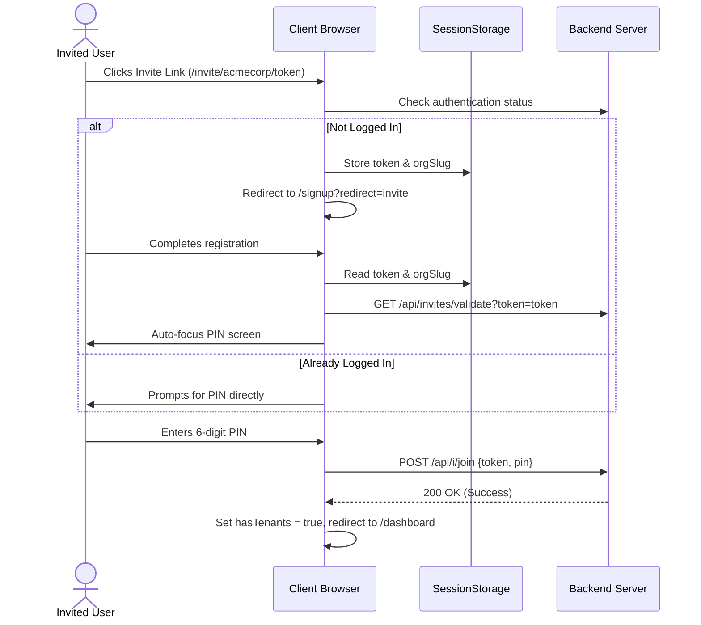

# HiveSpace User Onboarding Flow

This document details the architecture, state management, and user experience flow for user onboarding in HiveSpace. It covers how the frontend and backend coordinate to guide new users to their workspace.

---

## 1. Overview of the Flow

When a user signs up or logs into HiveSpace, they must belong to at least one organization (tenant) to access the main system features. The onboarding flow acts as a gatekeeper:



---

## 2. Onboarding Gatekeeping (`hasTenants` State)

The system determines whether a user needs to go through onboarding based on the `hasTenants` boolean property of the logged-in user.

### Logic & Redirection Rules
- **Backend check**: During authentication (`/api/auth/login`, `/api/auth/register`, or callback APIs), the backend queries if the user is associated with any tenants (organizations) and responds with `hasTenants: boolean` in the user payload.
- **Frontend check**: Inside the protected dashboard layouts (e.g., `frontend/app/(auth)/dashboard/page.tsx`), the page checks the user context:
  ```typescript
  if (!loading && user && !user.hasTenants && !allowOrgSetupModals) {
    router.push("/onboarding");
  }
  ```
- **Updating the state**: Once a user successfully creates or joins an organization, the local state is updated to prevent routing loops:
  ```typescript
  const setUser = useAuthStore.getState().setUser;
  const currentUser = useAuthStore.getState().user;
  if (currentUser) {
    setUser({ ...currentUser, hasTenants: true });
  }
  ```

---

## 3. Organic Onboarding (No Pending Invite)

If a user lands on `/onboarding` organically (without clicking a specific invite link), they are presented with a selection screen containing two options:

### Option 1: Create an Organization
- **Action**: User clicks **"Create an Organization"**.
- **Process**: 
  - They are redirected to `/dashboard?action=create-organization` (or a modal opens).
  - The user provides the organization's name, description, and settings.
  - On submission, the backend creates the organization, makes the user the owner/admin, and assigns them to the default `#general` channel.
  - `hasTenants` is set to `true`, and the dashboard loads fully.

### Option 2: Join an Organization (Manual)
- **Action**: User clicks **"Join an Organization"**.
- **Process**:
  - The UI transitions inline to show the Join form:
    1. **Invite Link / Token Input**: A text input to paste the full invite link (`hivespace.app/invite/[orgSlug]/[token]`) or a raw token.
    2. **PIN Input**: A 6-digit secure numerical input (using individual OTP-like character inputs).
  - **Inline Validation**: As soon as a valid invite link is pasted, the client extracts the token and calls:
    `GET /api/invites/validate?token=[token]`
    On success, the UI displays a confirmation: *"You are joining [Org Name] as a [Role]"*.
  - **Submission**: Clicking "Join" calls `POST /api/i/join` with `{ token, pin }`. On success, the user is joined, `hasTenants` updates, and they redirect to the dashboard.

---

## 4. Chained Onboarding (Via Invite Links)

A common entry point is a direct link shared via WhatsApp, Email, or Slack (e.g., `hivespace.app/invite/acmecorp/abc123xyz`).



### The `sessionStorage` Bridge
To ensure users aren't forced to copy and paste links manually when signing up:
1. **Landing on the Invite Page**: If a user hits `frontend/app/(public)/invite/[orgSlug]/[token]/page.tsx` and is not authenticated, the page stores the credentials in `sessionStorage`:
   ```typescript
   sessionStorage.setItem("pendingInviteToken", token);
   sessionStorage.setItem("pendingInviteOrgSlug", orgSlug);
   router.push("/signup?redirect=invite");
   ```
2. **Post-Registration Consumption**: In `/onboarding`, an effect runs on mount to check for pending session tokens:
   ```typescript
   useEffect(() => {
     const pendingToken = sessionStorage.getItem("pendingInviteToken");
     const pendingSlug = sessionStorage.getItem("pendingInviteOrgSlug");
     if (pendingToken) {
       // Clear session storage so it doesn't trigger again
       sessionStorage.removeItem("pendingInviteToken");
       sessionStorage.removeItem("pendingInviteOrgSlug");
       // Transition straight to the join view, prefilling values
       setMode("join");
       ...
     }
   }, []);
   ```

---

## 5. Technical References & Key Code Locations

- **Onboarding Page UI**: [onboarding/page.tsx](file:///d:/project/hiveSpace_final/frontend/app/(auth)/onboarding/page.tsx)
  - Handles the dual option screen, the OTP/PIN layout, and the `sessionStorage` redirection bridge.
- **Invite Landing Page**: [invite/[orgSlug]/[token]/page.tsx](file:///d:/project/hiveSpace_final/frontend/app/(public)/invite/[orgSlug]/[token]/page.tsx)
  - Intercepts direct invitation URLs and handles routing for both authenticated and anonymous visitors.
- **State Store**: [authStore.ts](file:///d:/project/hiveSpace_final/frontend/store/authStore.ts)
  - Holds user data including `hasTenants` state.
- **Invite API Services**: [invites.ts](file:///d:/project/hiveSpace_final/frontend/lib/api/invites.ts)
  - Contains API wrappers for backend interaction (`getInviteDetails`, `joinInvite`).
