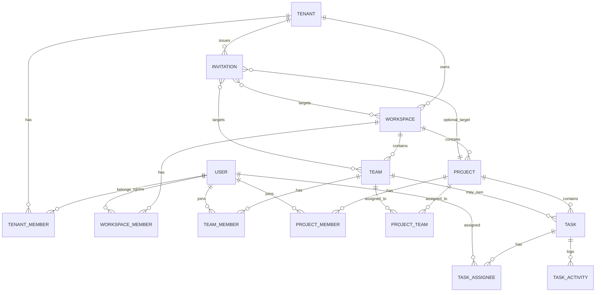
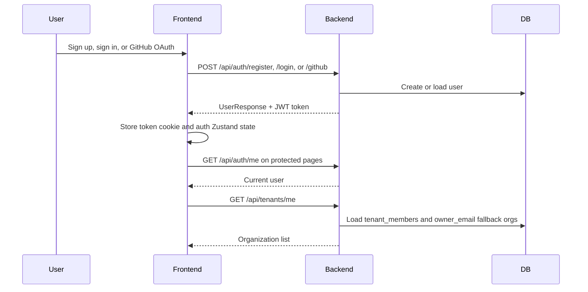
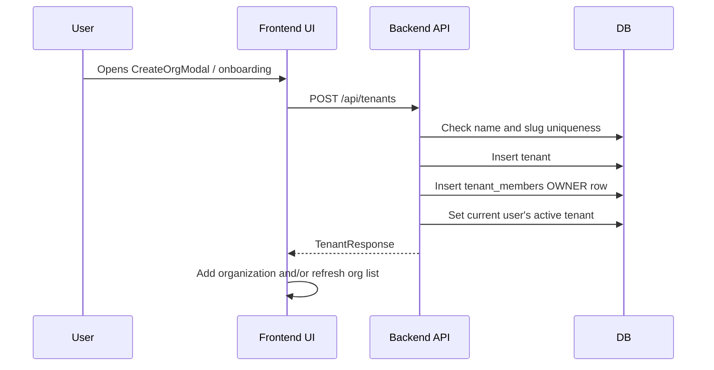
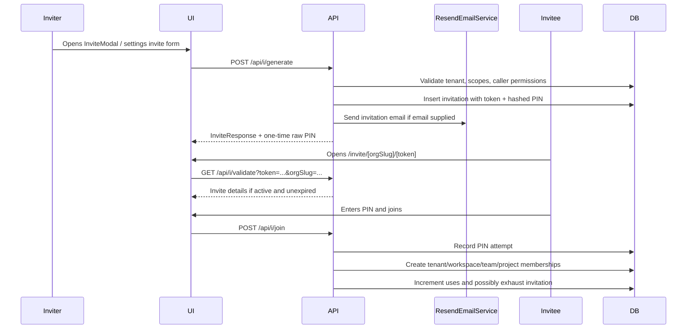
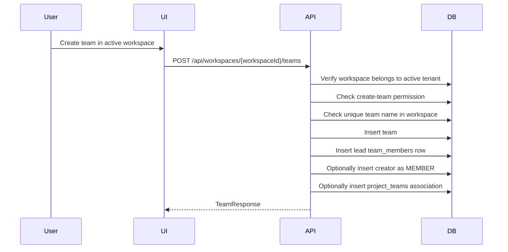
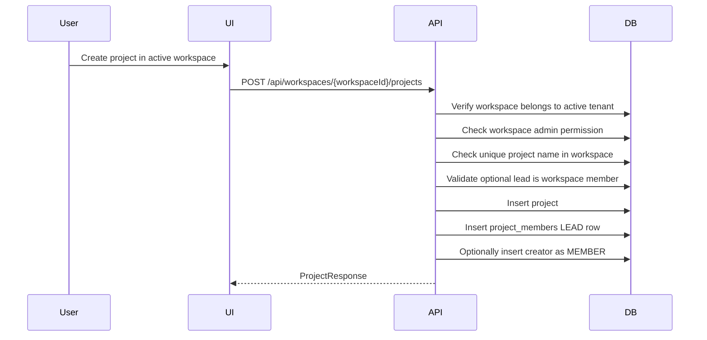
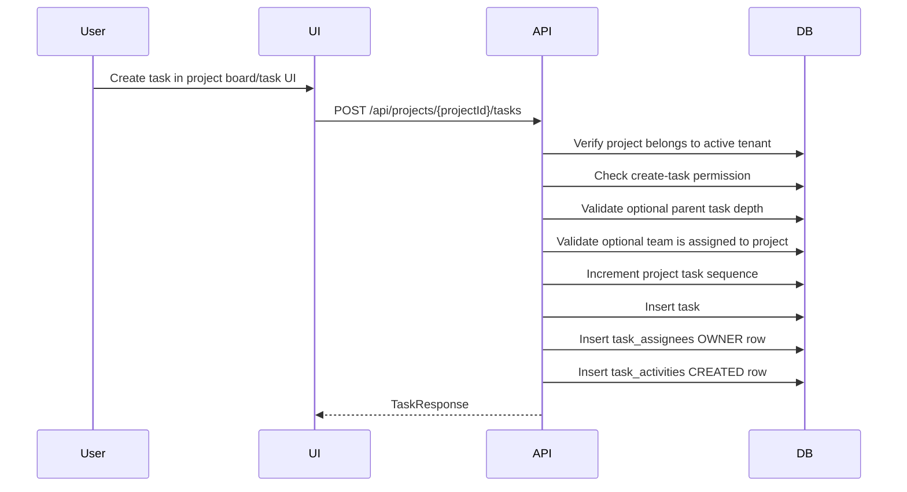
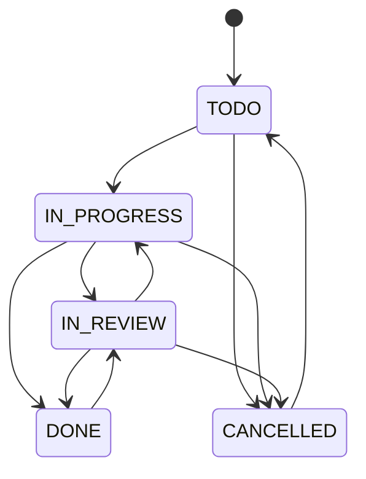

# HiveSpace Application Workflow Analysis

> Scope: This document describes the current implementation observed in the repository. It does not prescribe refactors or new behavior. When behavior is unclear or inferred, it is explicitly marked as an assumption or observation.

## Executive Summary

HiveSpace is a multi-tenant collaboration application built around organizations, workspaces, teams, projects, tasks, memberships, invitations, and share links.

Confirmed high-level hierarchy:

The backend is a Spring Boot application with controllers, services, repositories, JPA entities, JWT authentication, and an RBAC service. The frontend is a Next.js App Router application using Zustand for persistent app state, TanStack Query for selected server data, API wrapper functions, and route-level UI components.

---

## 1. End-to-End Workflow

### 1.1 Authentication and Active Organization Context

Confirmed behavior:

1. User registration creates a user with encoded password, active flag, avatar color, timestamps, and a JWT.
2. Login validates email/password and active status, then returns a JWT.
3. GitHub login exchanges a code, loads GitHub user info, links by GitHub ID or email, creates a user if necessary, and returns a JWT.
4. Frontend stores the JWT in a `token` cookie and persists auth state in Zustand.
5. Organization state is stored in `hivespace-orgs`; the active organization ID is also sent as `X-Tenant-Id` by the API client.
6. Backend tenant scoping primarily uses `User.tenant`, not the `X-Tenant-Id` header. Switching organization calls `/api/auth/switch-tenant`, verifies membership, sets `user.tenant`, and returns a new token.

### 1.2 Organization Creation Process

Confirmed backend behavior:

- Endpoint: `POST /api/tenants`.
- Service: `TenantService.createTenant`.
- The current authenticated user becomes the organization owner.
- A `TenantMember` row is created with role `OWNER`.
- The user's active `tenant` field is set to the newly created tenant.
- Tenant name and slug are normalized and checked case-insensitively for uniqueness.

Confirmed frontend behavior:

- API client: `createOrganization()` posts to `/api/tenants`.
- Organization list is loaded from `/api/tenants/me`.
- Zustand store persists organizations and auto-selects the first organization if no active one exists.

### 1.3 Workspace Creation Process

Although the prompt focuses on organizations, teams, projects, and tasks, workspaces are a required middle layer in the implementation.

Confirmed workflow:

1. User selects or creates an active organization.
2. User creates a workspace through frontend workspace UI.
3. Frontend posts to `POST /api/workspaces` with `tenantId`, `name`, and optional `description`.
4. Backend verifies the requested tenant matches `currentUser.tenant`.
5. Backend requires tenant role `ADMIN` or above; because rank comparison is used, `OWNER` also qualifies.
6. Backend checks workspace name uniqueness within the tenant.
7. Backend creates the workspace.
8. Backend adds the creator as a `WorkspaceMember` with role `ADMIN`.

### 1.4 User Invitation and Onboarding Flow

Confirmed invitation creation behavior:

- Endpoint: `POST /api/i/generate`.
- Service: `InvitationService.createInvite`.
- Caller must be organization `OWNER` or `ADMIN`; `BILLING_ADMIN` is intentionally excluded by `canManageInvite`.
- Invite targets may include tenant role, one or more workspaces, one or more teams, and an optional project.
- Target workspaces, teams, and project must belong to the invitation tenant.
- If teams are targeted, their workspaces are auto-included.
- Caller must have at least workspace `MEMBER` access to each workspace the invitee will join.
- A secure token and 6-digit PIN are generated if no PIN is supplied.
- PIN is stored as a password hash; the raw PIN is returned only at creation time.
- Invitation expires after 7 days by default.
- If an email is supplied, `ResendEmailService.sendInvitationEmail` is invoked with invite URL and PIN.

Confirmed invitation acceptance behavior:

- Endpoint: `POST /api/i/join`.
- Service: `InvitationService.acceptInvite`.
- Requires authenticated current user.
- Validates invitation is active, not expired, and not exhausted.
- Records PIN attempts in `invitation_attempts`.
- Five failed attempts in the last 15 minutes revokes the invitation.
- Successful join creates missing membership rows in this order: tenant, targeted workspaces, targeted teams and their workspaces, optional project and its workspace.
- If user has no active tenant, it is set to the invitation tenant.
- `currentUses` increments and invitation becomes `EXHAUSTED` when max uses is reached.

### 1.5 Team Creation and Management Workflow

Confirmed behavior:

- Workspace `MEMBER` or above can create teams. Tenant `OWNER` and `ADMIN` also qualify through fallback rules.
- Optional `leadUserId` must already be a workspace member.
- If no lead is supplied, creator becomes team `LEAD`.
- If lead is someone else, lead gets `LEAD` and creator gets `MEMBER`.
- Optional project association is allowed only if caller has project `MEMBER` or above and project is in the same workspace.
- Team update/delete requires team `LEAD` or workspace admin.
- Team members can be listed, added, role-updated, and removed through `/api/teams/{teamId}/members` service methods.

### 1.6 Project Creation Process

Confirmed behavior:

- Creating projects requires workspace admin privileges.
- Tenant `OWNER` or `ADMIN` can indirectly admin workspaces through RBAC fallback.
- Project name must be unique within the workspace.
- Optional lead must be a workspace member.
- If no lead is supplied, creator becomes project `LEAD`.
- If lead is supplied and differs from creator, lead becomes `LEAD` and creator becomes `MEMBER`.
- Project update requires project `LEAD` or workspace admin.
- Assigning/unassigning teams to projects requires project `LEAD` or workspace admin, and team/project must share a workspace.

### 1.7 Task Creation and Assignment Workflow

Confirmed behavior:

- A project `MEMBER` or `LEAD` can create tasks.
- A user in a team assigned to the project can also create tasks, even without an explicit `project_members` row.
- Task defaults: `status = TODO`, `priority = MEDIUM`.
- Subtasks are allowed only one level deep; subtasks of subtasks are rejected.
- Optional `teamId` must be a team assigned to the project.
- Project task sequence is incremented and used for a task identifier/sequence number.
- Optional `assigneeId` must be eligible for the project.
- A task owner is stored in `task_assignees` with role `OWNER`.
- Task changes produce activity records for changed fields.
- Status transitions are constrained by `validateStatusTransition`.

Task status lifecycle confirmed from implementation:

### 1.8 Share Links, Notifications, and Automation

Confirmed share-link behavior:

- `POST /api/projects/{id}/share` generates a public project share token.
- `GET /api/share/{token}` returns public project data.
- `PATCH /api/share/{id}/revoke` revokes a link.
- Share links track `accessCount`, `lastAccessedAt`, `expiresAt`, `isActive`, and creator.

Confirmed notification/automation behavior:

- Invitation email sending exists through `ResendEmailService` when email is supplied.
- Task activity logging exists as an audit/activity mechanism.
- No confirmed backend cron jobs, queues, schedulers, or async event queues were found in the inspected implementation.
- Frontend has settings pages for notifications, automations, webhooks, etc., but the inspected backend workflows do not confirm implemented automation/cron behavior for those pages.

---

## 2. Backend Analysis

### 2.1 Backend Structure

Backend root: `backend/`.

| Folder | Responsibility |
|---|---|
| `src/main/java/com/project/hiveSpace/controllers` | HTTP REST controllers |
| `src/main/java/com/project/hiveSpace/services` | Business logic and transaction boundaries |
| `src/main/java/com/project/hiveSpace/repository` | Spring Data repositories |
| `src/main/java/com/project/hiveSpace/models` | JPA entities and enums |
| `src/main/java/com/project/hiveSpace/dto` | Request/response DTOs |
| `src/main/java/com/project/hiveSpace/security` | JWT, Spring Security, RBAC |
| `src/main/java/com/project/hiveSpace/exceptions` | Domain exception types and global handler |
| `src/main/resources/application.properties` | Backend configuration |
| `src/test/java/...` | Security and service tests |

### 2.2 Authentication and Authorization

Confirmed authentication:

- Spring Security is configured with JWT bearer authentication.
- `JwtAuthenticationFilter` extracts and validates tokens.
- `ApplicationConfig` loads users by email.
- Passwords are encoded with BCrypt.
- Authenticated principal is the JPA `User` entity.
- Frontend stores the token in a cookie and sends `Authorization: Bearer <token>`.

Confirmed authorization patterns:

- Some controllers use `@PreAuthorize`, for example project creation, team creation, task creation, task assignee operations, and tenant member role/removal.
- Many service methods also enforce RBAC explicitly with `RbacService` and exception checks.
- Tenant scoping is enforced by `verifyResourceBelongsToTenant(resourceId, ResourceType)` using the authenticated user's active `User.tenant`.

### 2.3 RBAC Implementation

| Scope | Roles | Ranking / Meaning |
|---|---|---|
| Tenant / organization | `OWNER`, `ADMIN`, `BILLING_ADMIN`, `MEMBER` | Owner highest; billing admin has billing-limited behavior in frontend and invite exclusion in backend |
| Workspace | `ADMIN`, `MEMBER`, `VIEWER` | Admin can manage workspace members and create projects |
| Project | `LEAD`, `MEMBER`, `VIEWER` | Lead can manage project-level actions; member can create/edit tasks |
| Team | `LEAD`, `MEMBER` | Lead can manage team members/team settings |
| Task assignee | `OWNER`, `COLLABORATOR`, `REVIEWER` | Owner can manage assignees; collaborator/reviewer are task-level roles |

Key backend capability rules:

| Capability | Confirmed backend rule |
|---|---|
| Create organization | Any authenticated user can call `POST /api/tenants` |
| Create workspace | Active tenant must match request tenant; tenant role `ADMIN` or above |
| List workspaces | Active tenant must match; tenant `MEMBER` or above |
| Admin workspace | Workspace `ADMIN`, or tenant `OWNER`/`ADMIN` fallback |
| Create team | Workspace `MEMBER` or above, or tenant `OWNER`/`ADMIN` fallback |
| Create project | Workspace admin only, including tenant `OWNER`/`ADMIN` fallback |
| View project | Explicit project `VIEWER`+, member of assigned team, or workspace admin |
| Create task | Project `MEMBER`+ or member of a team assigned to project |
| Edit task | Project `MEMBER`+ or member of a team assigned to project |
| Delete task | Project `LEAD` or workspace admin |
| Add/change task assignee | Task owner, project lead, task team lead, or workspace admin |
| Remove task assignee | User can remove self, otherwise same as add/change assignee |
| Manage invites | Tenant `OWNER` or `ADMIN` only |

### 2.4 Database Schema and Entity Relationships

| Entity | Purpose | Important relationships |
|---|---|---|
| `User` | Authenticated account | Optional active `Tenant`; many memberships |
| `Tenant` | Organization | Owns workspaces; has tenant members; owner email |
| `TenantMember` | User role in org | Unique tenant/user pair |
| `Workspace` | Container within org | Belongs to tenant; has teams/projects/members |
| `WorkspaceMember` | User role in workspace | Unique workspace/user pair |
| `Team` | Group inside workspace | Belongs to workspace; has members; can be assigned to projects |
| `TeamMember` | User role in team | Unique team/user pair |
| `Project` | Work package inside workspace | Belongs to workspace; has members, teams, tasks |
| `ProjectMember` | User role in project | Unique project/user pair |
| `ProjectTeam` | Join table | Assigns team to project |
| `Task` | Work item | Belongs to project; optional team and parent task |
| `TaskAssignee` | Task assignment | Unique task/user pair; role owner/collaborator/reviewer |
| `TaskActivity` | Audit/activity row | Belongs to task; optional acting user |
| `Invitation` | Join token | Belongs to tenant; optional project; many workspaces/teams |
| `InvitationAttempt` | PIN attempt log | Belongs to invitation |
| `ShareableLink` | Public access token | Project/workspace/team scoped; currently project share API is implemented |

### 2.5 API Endpoint Map

| Workflow | Method / Path | Backend component |
|---|---|---|
| Register | `POST /api/auth/register` | `AuthController`, `AuthService` |
| Login | `POST /api/auth/login` | `AuthController`, `AuthService` |
| GitHub login | `POST /api/auth/github` | `AuthController`, `GitHubService`, `AuthService` |
| Current user | `GET /api/auth/me` | `AuthController` |
| Switch org | `POST /api/auth/switch-tenant` | `AuthService.switchTenant` |
| Create org | `POST /api/tenants` | `TenantService.createTenant` |
| List my orgs | `GET /api/tenants/me` | `TenantService.getTenantsForCurrentUser` |
| Org members | `GET /api/tenants/{tenantId}/members` | `TenantService.getMembersByTenantId` |
| Update org member role | `PUT /api/tenants/{tenantId}/members/{userId}/role` | `TenantService.updateMemberRole` |
| Remove org member | `DELETE /api/tenants/{tenantId}/members/{userId}` | `TenantService.removeMember` |
| Create workspace | `POST /api/workspaces` | `WorkspaceService.createWorkspace` |
| List workspaces | `GET /api/workspaces/t/{tenantId}` | `WorkspaceService.getWorkspacesByTenant` |
| Workspace members | `GET /api/workspaces/{workspaceId}/members` | `WorkspaceService.getWorkspaceMembers` |
| Add workspace member | `POST /api/workspaces/{workspaceId}/members` | `WorkspaceService.addWorkspaceMember` |
| Update workspace role | `PATCH /api/workspaces/{workspaceId}/members/{userId}/role` | `WorkspaceService.updateWorkspaceMemberRole` |
| Remove workspace member | `DELETE /api/workspaces/{workspaceId}/members/{userId}` | `WorkspaceService.removeWorkspaceMember` |
| Create team | `POST /api/workspaces/{workspaceId}/teams` | `TeamService.createTeam` |
| List teams | `GET /api/workspaces/{workspaceId}/teams` | `TeamService.getTeamsByWorkspace` |
| Update team | `PUT /api/workspaces/{workspaceId}/teams/{teamId}` | `TeamService.updateTeam` |
| Delete team | `DELETE /api/workspaces/{workspaceId}/teams/{teamId}` | `TeamService.deleteTeam` |
| Team members | `/api/teams/{teamId}/members` | `TeamMemberService` |
| Create project | `POST /api/workspaces/{workspaceId}/projects` | `ProjectService.createProject` |
| List projects | `GET /api/workspaces/{workspaceId}/projects` | `ProjectService.getProjectsByWorkspace` |
| Update project | `PUT /api/projects/{projectId}` | `ProjectService.updateProject` |
| Project members | `/api/projects/{projectId}/members` | `ProjectMemberService` |
| Assign project team | `POST /api/projects/{projectId}/teams` | `ProjectService.assignTeam` |
| Unassign project team | `DELETE /api/projects/{projectId}/teams/{teamId}` | `ProjectService.unassignTeam` |
| Create task | `POST /api/projects/{projectId}/tasks` | `TaskService.createTask` |
| List project tasks | `GET /api/projects/{projectId}/tasks` | `TaskService.getTasksByProject` |
| Global visible tasks | `GET /api/tasks` | `TaskService.getAllTasks` |
| Update task | `PUT /api/tasks/{taskId}` | `TaskService.updateTask` |
| Update task status | `PATCH /api/tasks/{taskId}/status` | `TaskService.updateTaskStatus` |
| Delete task | `DELETE /api/tasks/{taskId}` | `TaskService.deleteTask` |
| Task activities | `GET /api/tasks/{taskId}/activities` | `TaskService.getTaskActivities` |
| Task assignees | `/api/tasks/{taskId}/assignees` | `TaskAssigneeService` |
| Generate invite | `POST /api/i/generate` | `InvitationService.createInvite` |
| Validate invite | `GET /api/i/validate` | `InvitationService.getInvite` |
| Accept invite | `POST /api/i/join` | `InvitationService.acceptInvite` |
| Tenant invitations | `GET /api/i/t/{tenantId}` | `InvitationService.getInvitationsByTenant` |
| Revoke invite | `DELETE /api/i/{id}` | `InvitationService.revokeInvite` |
| Generate share link | `POST /api/projects/{id}/share` | `ShareableLinkService` |
| Public share data | `GET /api/share/{token}` | `ShareableLinkService` |
| Revoke share link | `PATCH /api/share/{id}/revoke` | `ShareableLinkService` |

### 2.6 Service Layer Responsibilities

| Service | Confirmed responsibilities |
|---|---|
| `AuthService` | Register/login/GitHub login/profile update/switch active tenant/token generation |
| `TenantService` | Create organizations, list orgs, manage tenant members and roles |
| `WorkspaceService` | Create/list workspaces, manage workspace memberships |
| `TeamService` | Create/update/delete/list teams, assign initial lead, optional project association |
| `TeamMemberService` | Team member listing/add/update/remove with RBAC checks |
| `ProjectService` | Create/list/update projects, assign/unassign teams, map project responses |
| `ProjectMemberService` | Project member listing/add/update/remove and team-member-derived project visibility |
| `TaskService` | Create/list/update/delete tasks, status transitions, subtasks, activity logs |
| `TaskAssigneeService` | Add/remove/change task assignees and owners |
| `InvitationService` | Generate/validate/accept/revoke invitations, PIN security, email dispatch |
| `ShareableLinkService` | Generate/read/revoke public project links |
| `ResendEmailService` | Send invitation emails |
| `GitHubService` | GitHub OAuth token and user info retrieval |
| `UserService` | Current profile retrieval |

### 2.7 Validation, Error Handling, and Business Rules

Confirmed validation/business rules:

- Duplicate user email rejected on register.
- Tenant name and slug uniqueness checked case-insensitively.
- Workspace name unique within tenant.
- Team name unique within workspace.
- Project name unique within workspace.
- Workspace creation must happen inside active tenant.
- Resource access validates resource belongs to current active tenant.
- Leads for projects/teams must be workspace members.
- Team-project association must remain within the same workspace.
- Task team must already be associated with task project.
- Task nesting max depth is one level.
- Task owner/assignee must be eligible project participant.
- Task status transitions are constrained.
- Last workspace administrator cannot be removed.
- Primary organization owner cannot be removed or role-changed.
- Admin role promotion/demotion rules are stricter than member role changes.
- Invitation PIN is hashed; failed PIN attempts are rate-limited and can revoke invite.

Error handling:

- Domain exceptions include `ForbiddenException`, `NotFoundException`, `ConflictException`, and `DomainValidationException`.
- Many methods also throw `IllegalArgumentException` for validation failures.
- Global exception handling exists in backend exceptions package.

---

## 3. Frontend Analysis

### 3.1 Frontend Structure

Frontend root: `frontend/`.

| Folder | Responsibility |
|---|---|
| `app/` | Next.js App Router routes, layouts, API proxy routes |
| `components/common` | Shared UI components and invite modal pieces |
| `components/features/organizations` | Organization creation/join UI |
| `components/features/workspaces` | Workspace creation UI |
| `components/features/teams` | Team pages, tabs, create/manage UI |
| `components/features/projects` | Project creation UI |
| `components/features/tasks` | Task creation, board, card, detail, activity UI |
| `components/features/settings` | Member/invite/settings UI |
| `hooks/` | UI data hooks over stores and API clients |
| `store/` | Zustand persistent state stores |
| `lib/api` | Typed API wrapper functions |
| `lib/permissions` | Frontend permission helpers |
| `types` | Role and domain TypeScript types |

### 3.2 Pages and Routes Involved

| Route | Purpose |
|---|---|
| `/signup`, `/signin` | Public auth pages |
| `/auth/github/callback` | GitHub OAuth callback page |
| `/onboarding` | Authenticated onboarding route |
| `/dashboard` | Main authenticated dashboard |
| `/dashboard/projects/[projectSlug]` | Project detail route |
| `/dashboard/projects/[projectSlug]/board` | Project board route |
| `/dashboard/tasks` | Task listing route |
| `/dashboard/teams/[teamSlug]` | Team detail route |
| `/settings/members` | Members/invite related settings |
| `/settings/roles` | Roles and permission display |
| `/settings/automations` | Automation settings UI route, backend implementation unclear from inspected workflow code |
| `/invite/[orgSlug]/[token]` | Public invite validation/join route |
| `/share/[orgSlug]/project/[token]` | Public project share route |
| `/api/[...path]` | Next.js proxy to backend |

### 3.3 State Management

Confirmed state mechanisms:

- Zustand persistent stores: `authStore`, `orgStore`, `workspaceStore`, `projectStore`, `teamStore`, `taskStore`, and `shareStore`.
- TanStack Query is used for organization member data through `useMembers` and `useActiveMembership`.
- The API client dynamically reads active org from the org store and sends it as `X-Tenant-Id`, though backend authorization depends on `User.tenant`.

### 3.4 Data Fetching and Mutations

Confirmed API wrapper pattern:

- All frontend API files call `apiFetch` from `lib/api/client.ts`.
- `apiFetch` attaches JSON content type, JWT bearer token, and active tenant header.
- Errors are normalized into `ApiError` with backend message when possible.
- Same-origin `/api/*` can be proxied by Next's catch-all API route.

| Module | Backend scope |
|---|---|
| `auth.ts` | GitHub login, current user, profile update, switch tenant |
| `orgs.ts` | Tenant create/list/member operations |
| `workspaces.ts` | Workspace create/list/member operations |
| `teams.ts` | Team create/list/update/delete/member operations |
| `projects.ts` | Project create/list/member/team assignment operations |
| `tasks.ts` | Task create/list/update/delete/assignee/activity operations |
| `invites.ts` | Invite generate/validate/join/list operations |
| `share.ts` | Project share link operations |

### 3.5 Forms, Validation, and User Interactions

| Workflow | Components |
|---|---|
| Organization creation | `CreateOrgModal`, onboarding page |
| Organization joining | `JoinOrgModal`, invite public route |
| Invitation | `InviteModal`, `InviteForm`, invite modal sections for email, role, workspace, team, link, success |
| Workspace creation | `CreateWorkspaceModal` |
| Team creation/management | `CreateTeamModal`, `ManageTeamSheet`, `MembersTab`, `OverviewTab`, `TasksTab`, `TeamHeader`, `TeamBreadcrumbs` |
| Project creation | `CreateProjectModal` |
| Task creation/management | `CreateTaskModal`, `KanbanBoard`, `KanbanCard`, `TaskDetail`, `TaskActivityFeed`, `TaskFilters` |
| Settings members/roles | `MemberRow`, `AddToWorkspaceModal`, role matrix/list components |

Frontend validation is implemented in forms/components where present, but authoritative validation is backend-side. The inspected API wrappers pass user-entered payloads directly to backend endpoints.

### 3.6 Permissions Reflected in UI

| UI Permission | Frontend rule |
|---|---|
| Invite to org | Tenant role rank >= `ADMIN` |
| Create workspace | Tenant role rank >= `ADMIN` |
| Manage tenant members | Tenant role rank >= `ADMIN` |
| View member directory | Any tenant role except `BILLING_ADMIN` |
| Access billing | `OWNER` or `BILLING_ADMIN` |
| Admin workspace | Workspace `ADMIN` or tenant role rank >= `ADMIN` |
| Create project | Workspace admin |
| Create team | Tenant admin/owner or workspace `MEMBER`+ |
| View workspace | Tenant admin/owner or any workspace role |
| Create task | Project role in configurable localStorage matrix; defaults to `MEMBER` and `LEAD` |
| Manage project | Project `LEAD` or workspace admin |
| Manage team | Team `LEAD` or workspace admin |

Observation: the frontend permissions mostly mirror backend rules, but project-role and team-assigned-project behavior can diverge because backend allows users in assigned teams to view/create/edit project tasks without an explicit project role, while frontend `canCreateTask(projectRole)` returns false when `projectRole` is null.

### 3.7 Navigation Paths

| Operation | Navigation path |
|---|---|
| Sign up/sign in | `/signup` or `/signin` |
| Create first organization | `/onboarding` or organization modal in authenticated area |
| Select organization | Organization switcher/state, then `/api/auth/switch-tenant` when switching backend context |
| Create workspace | Dashboard/sidebar workspace UI via `CreateWorkspaceModal` |
| Invite user | Settings members/invite UI or common `InviteModal` |
| Accept invite | `/invite/[orgSlug]/[token]`, enter PIN, submit join |
| Create team | Active workspace dashboard/team UI via `CreateTeamModal` |
| Manage team | `/dashboard/teams/[teamSlug]` with overview/members/tasks tabs |
| Create project | Active workspace project UI via `CreateProjectModal` |
| Project board | `/dashboard/projects/[projectSlug]/board` |
| Create task | Project board/task UI via `CreateTaskModal` |
| Manage task | Board card/detail UI via `TaskDetail` and task API mutations |

---

## 4. Role and Scope Analysis

### 4.1 Role Purpose Matrix

| Scope | Role | Purpose |
|---|---|---|
| Tenant | `OWNER` | Primary organization owner; highest org authority |
| Tenant | `ADMIN` | Organization administrator; can manage members/invites and create workspaces |
| Tenant | `BILLING_ADMIN` | Billing-focused role; excluded from invite/member-directory management in backend/frontend rules |
| Tenant | `MEMBER` | Normal org member; can view member directory and access org-scoped resources depending memberships |
| Workspace | `ADMIN` | Workspace manager; can create projects, manage workspace members, and inherits project/team admin powers |
| Workspace | `MEMBER` | Workspace participant; can create teams and view workspace resources where allowed |
| Workspace | `VIEWER` | Read-only workspace membership for listing/viewing member directory and teams |
| Project | `LEAD` | Project manager; can update project, assign teams, manage project members, delete tasks |
| Project | `MEMBER` | Project contributor; can create and edit tasks |
| Project | `VIEWER` | Project read access |
| Team | `LEAD` | Team manager; can update/delete team and manage team members |
| Team | `MEMBER` | Team participant; gains project access when team is assigned to project |
| Task | `OWNER` | Primary responsible assignee; can manage task assignees |
| Task | `COLLABORATOR` | Secondary task participant |
| Task | `REVIEWER` | Review-oriented task participant |

### 4.2 Permission Matrix

| Action | OWNER | ADMIN | BILLING_ADMIN | MEMBER | Workspace ADMIN | Workspace MEMBER | Workspace VIEWER | Project LEAD | Project MEMBER | Project VIEWER | Team LEAD | Team MEMBER |
|---|---:|---:|---:|---:|---:|---:|---:|---:|---:|---:|---:|---:|
| Create organization | Yes* | Yes* | Yes* | Yes* | N/A | N/A | N/A | N/A | N/A | N/A | N/A | N/A |
| Create workspace | Yes | Yes | No | No | N/A | N/A | N/A | N/A | N/A | N/A | N/A | N/A |
| Invite org users | Yes | Yes | No | No | No | No | No | No | No | No | No | No |
| View org members | Yes | Yes | No | Yes | N/A | N/A | N/A | N/A | N/A | N/A | N/A | N/A |
| Manage workspace members | Yes† | Yes† | No | No | Yes | No | No | N/A | N/A | N/A | N/A | N/A |
| Create team | Yes† | Yes† | No | No | Yes | Yes | No | N/A | N/A | N/A | N/A | N/A |
| Create project | Yes† | Yes† | No | No | Yes | No | No | N/A | N/A | N/A | N/A | N/A |
| Update project | Yes† | Yes† | No | No | Yes | No | No | Yes | No | No | N/A | N/A |
| Assign team to project | Yes† | Yes† | No | No | Yes | No | No | Yes | No | No | N/A | N/A |
| View project | Yes† | Yes† | No | No | Yes | No | No | Yes | Yes | Yes | Via assigned team | Via assigned team |
| Create/edit task | No direct | No direct | No | No | No direct | No direct | No | Yes | Yes | No | Via assigned team | Via assigned team |
| Delete task | Yes† | Yes† | No | No | Yes | No | No | Yes | No | No | No direct | No direct |
| Manage task assignees | Yes† | Yes† | No | No | Yes | No | No | Yes | No | No | If task team lead | No |

Notes:

- `Yes*`: any authenticated user can create a new organization; tenant role is not needed before creation.
- `Yes†`: tenant owner/admin gain powers through workspace-admin fallback for resources inside their tenant.
- `No direct`: role alone does not grant the action unless combined with another scoped role.

### 4.3 Frontend vs Backend Role Boundaries

Confirmed alignment:

- Tenant owner/admin can invite and create workspaces in both frontend and backend.
- Billing admin is excluded from invites and member directory by frontend helpers and backend checks.
- Workspace admin can create projects in both frontend and backend.
- Workspace member can create teams in both frontend and backend.
- Project lead can manage project-level settings and team assignments in backend and frontend helper logic.

Observed divergence:

- Backend grants project/task access to members of teams assigned to a project. Frontend permission helpers primarily require explicit `projectRole` and may hide task creation controls for team-derived access.
- Backend `hasTenantRole(ADMIN)` rank check treats `OWNER` as allowed, but because `BILLING_ADMIN` has rank 2 and `MEMBER` rank 1, `hasTenantRole(MEMBER)` also returns true for `BILLING_ADMIN`. Some service-specific rules separately exclude billing admins; not all generic member checks do.
- Frontend task creation permission can be customized by localStorage key `hivespace_roles_permissions`, while backend remains fixed. This can create UI/backend mismatch.

---

## 5. Workflow Mapping

### 5.1 Organization Workflow

| Item | Details |
|---|---|
| Trigger | User submits organization creation form/onboarding |
| Frontend components | `CreateOrgModal`, onboarding page, `useOrgs`, `orgStore`, `lib/api/orgs.ts` |
| Backend components | `TenantController`, `TenantService`, `TenantRepository`, `TenantMemberRepository`, `UserRepository` |
| API | `POST /api/tenants`, `GET /api/tenants/me` |
| DB operations | Insert tenant; insert owner tenant member; update user's active tenant |
| Authorization | Authenticated principal required; no pre-existing tenant role required |
| Outcome | New organization exists; creator is `OWNER`; frontend can select active org |
| State transition | User without org or existing user -> user with active tenant and owner membership |

### 5.2 Invitation / Onboarding Workflow

| Item | Details |
|---|---|
| Trigger | Owner/admin opens invite UI and generates invite |
| Frontend components | `InviteModal`, invite modal sections, `InviteForm`, public invite route |
| Backend components | `InvitationController`, `InvitationService`, `ResendEmailService`, membership repositories |
| API | `POST /api/i/generate`, `GET /api/i/validate`, `POST /api/i/join`, `DELETE /api/i/{id}` |
| DB operations | Insert invitation; insert attempt rows; insert tenant/workspace/team/project memberships; update invite usage/status |
| Authorization | Generate/list invite requires owner/admin; accept invite requires authenticated user and valid PIN |
| Outcome | Invitee joins requested organization/resource scopes |
| State transition | Invitation `ACTIVE` -> `EXHAUSTED`, `EXPIRED`, or `REVOKED`; invitee gains memberships |

### 5.3 Workspace Workflow

| Item | Details |
|---|---|
| Trigger | User creates workspace inside active organization |
| Frontend components | `CreateWorkspaceModal`, `useWorkspaces`, `workspaceStore`, `lib/api/workspaces.ts` |
| Backend components | `WorkspaceController`, `WorkspaceService`, `RbacService` |
| API | `POST /api/workspaces`, `GET /api/workspaces/t/{tenantId}`, member endpoints |
| DB operations | Insert workspace; insert creator `WorkspaceMember ADMIN`; manage member rows |
| Authorization | Active tenant match; tenant `OWNER`/`ADMIN` to create; workspace admin to manage members |
| Outcome | Workspace available as container for teams/projects |
| State transition | Tenant with no/new workspace -> workspace with one admin member |

### 5.4 Team Workflow

| Item | Details |
|---|---|
| Trigger | User creates team in active workspace |
| Frontend components | `CreateTeamModal`, team detail route, `ManageTeamSheet`, `MembersTab`, `useTeams`, `teamStore` |
| Backend components | `TeamController`, `TeamService`, `TeamMemberController`, `TeamMemberService`, `RbacService` |
| API | `POST /api/workspaces/{workspaceId}/teams`, `GET /api/workspaces/{workspaceId}/teams`, `/api/teams/{teamId}/members` |
| DB operations | Insert team; insert lead/member rows; optional project-team association |
| Authorization | Workspace member/tenant admin can create; lead/workspace admin can manage |
| Outcome | Team exists and may be attached to project |
| State transition | Workspace -> workspace with team; user -> team lead/member |

### 5.5 Project Workflow

| Item | Details |
|---|---|
| Trigger | Workspace admin creates project |
| Frontend components | `CreateProjectModal`, project detail/board routes, `useProjects`, `projectStore` |
| Backend components | `ProjectController`, `ProjectDetailsController`, `ProjectService`, `ProjectTeamController`, `ProjectMemberController` |
| API | `POST /api/workspaces/{workspaceId}/projects`, `GET /api/workspaces/{workspaceId}/projects`, `PUT /api/projects/{id}` |
| DB operations | Insert project; insert project lead/member rows; assign/unassign teams in `project_teams` |
| Authorization | Workspace admin for create; project lead/workspace admin for update/team assignment |
| Outcome | Project exists for task management and optional team participation |
| State transition | Workspace -> workspace with project; users/teams gain project scope |

### 5.6 Task Workflow

| Item | Details |
|---|---|
| Trigger | User creates task from project board/task UI |
| Frontend components | `CreateTaskModal`, `KanbanBoard`, `KanbanCard`, `TaskDetail`, `TaskActivityFeed`, `useTasks`, `taskStore` |
| Backend components | `TaskController`, `TaskService`, `TaskAssigneeController`, `TaskAssigneeService`, `RbacService` |
| API | `POST /api/projects/{projectId}/tasks`, `GET /api/projects/{projectId}/tasks`, `PUT /api/tasks/{taskId}`, assignee/activity endpoints |
| DB operations | Increment project task sequence; insert task; insert owner assignee; insert activity rows; update task fields/status |
| Authorization | Project member or assigned-team member can create/edit; project lead/workspace admin can delete; task owner/project lead/team lead/workspace admin can manage assignees |
| Outcome | Task appears in project board/list and has owner/activity history |
| State transition | Project -> project with sequenced task; task moves through constrained statuses |

---

## 6. Findings and Observations

### 6.1 Confirmed Inconsistencies Between Frontend and Backend

| Area | Observation |
|---|---|
| Active tenant header | Frontend sends `X-Tenant-Id`, but inspected backend RBAC uses `User.tenant`; switching org must call `/api/auth/switch-tenant` to align backend context. |
| Team-derived project access | Backend allows assigned team members to view/create/edit project tasks; frontend permission helpers may require explicit `projectRole`, hiding valid actions. |
| Frontend-configurable task permissions | Frontend `canCreateTask` can read localStorage permission matrix; backend uses fixed RBAC. UI may show/hide actions inconsistently with server authorization. |
| Invite accept auth | Public invite route exists, but backend `acceptInvite` requires authenticated current user. The route must ensure sign-in before join; otherwise join fails. |
| Organization join API | `joinOrganization()` in `orgs.ts` points to `/api/invitations/accept/{inviteCode}`, while implemented backend invitation acceptance is `/api/i/join`. This appears stale unless unused. |
| Duplicate project update controllers | Both `ProjectController` and `ProjectDetailsController` define project update endpoints. This may be redundant and could be ambiguous depending Spring mapping resolution. |

### 6.2 Missing or Uneven Authorization Checks

Confirmed concerns based strictly on inspected code:

- `ProjectMemberController` endpoints do not show controller-level `@PreAuthorize`; authorization may exist in `ProjectMemberService`, but this should be verified when auditing those service methods.
- `TeamMemberController` endpoints do not show controller-level `@PreAuthorize`; authorization may exist in `TeamMemberService`, but this should be verified when auditing those service methods.
- `InvitationController.createInvite` lacks controller-level `@PreAuthorize`; authorization is enforced in `InvitationService.createInvite`.
- Some read endpoints rely on service-layer checks rather than controller annotations; this is acceptable if consistently implemented, but mixed enforcement makes auditing harder.

### 6.3 Potential Bottlenecks and Maintainability Concerns

Observed maintainability concerns:

- RBAC rules are split between frontend permission helpers and backend `RbacService`; divergence already appears in team-derived project access and localStorage-configurable task permissions.
- Many response mappers calculate counts by additional repository calls (`membersCount`, `teamsCount`), which can become N+1-like at scale when listing many projects/teams/workspaces.
- The active tenant is stored on the user entity. In a multi-tab or multi-session scenario, switching active tenant in one session may affect authorization context in another session for the same user.
- Invitation acceptance performs many membership operations in one transaction. This is correct for consistency, but the flow is complex and sensitive to stale/deleted target resources.
- Some validation uses `IllegalArgumentException` while other rules use domain-specific exceptions; client error semantics may be inconsistent.
- Frontend stores several server-derived lists persistently in localStorage. Cached projects/teams/tasks may briefly reflect stale state until refetch completes.

### 6.4 Areas That May Lead to Unexpected Behavior

| Area | Potential behavior |
|---|---|
| Billing admin and generic member checks | Since tenant rank treats `BILLING_ADMIN` above `MEMBER`, generic `hasTenantRole(MEMBER)` calls may permit billing admins where the product intended billing-only access, unless separately excluded. |
| Project lead changes | Updating a project with a new lead promotes/adds that user to `LEAD`, but inspected logic does not clearly demote previous leads. Multiple project leads may exist. |
| Team lead changes | Team creation sets lead, but team update shown does not manage lead changes; lead management likely depends on team member role endpoints. |
| Invite max uses | A successful self-join by a user already in some scopes still increments invitation usage. This is confirmed behavior and may surprise inviters. |
| Public share links | Public project access exists by token. Users should understand revocation and expiry behavior because shared data is intentionally unauthenticated. |

---

## Confirmed Source Areas Reviewed

Backend:

- Controllers under `backend/src/main/java/com/project/hiveSpace/controllers`
- Services under `backend/src/main/java/com/project/hiveSpace/services`
- Entities and enums under `backend/src/main/java/com/project/hiveSpace/models`
- RBAC/JWT/Security under `backend/src/main/java/com/project/hiveSpace/security`

Frontend:

- Routes under `frontend/app`
- Components under `frontend/components/features` and `frontend/components/common`
- API clients under `frontend/lib/api`
- Permission helpers under `frontend/lib/permissions`
- Zustand stores under `frontend/store`
- Hooks under `frontend/hooks`
- Role types under `frontend/types/roles.ts`

## Assumptions and Limits

- This document is based on static inspection of the current codebase and does not include runtime verification.
- Where UI behavior depends on component internals not deeply expanded here, the document identifies components and API paths rather than claiming every visual condition.
- No code was modified or refactored as part of this analysis; only this Markdown documentation file was created.
