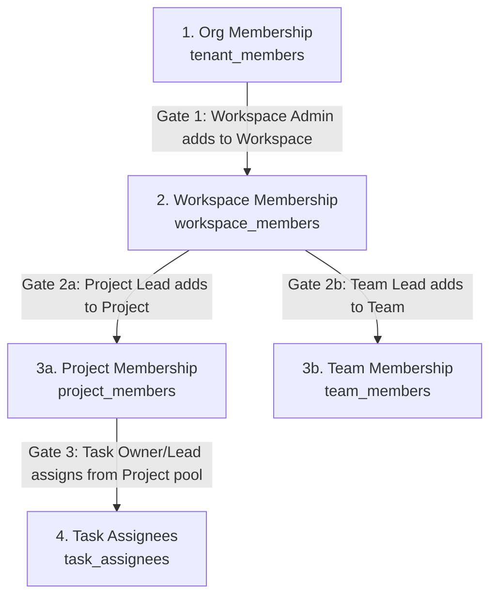

# HiveSpace: Project, Team, Task & Assignment Implementation Plan

This implementation plan details the frontend (UI/UX) and backend (Spring Boot & JPA) changes required to implement **Project Creation**, **Team Creation**, **Task Creation (Quick & Full)**, and **Multi-Role Task Assignment** on the HiveSpace platform. 

In accordance with our recent team alignment, **no database schema changes are required**. This entire plan leverages our existing PostgreSQL/Supabase schema (`CurrentSchema.md`) and enforces all business constraints, hierarchies, and transactional logic at the application layer.

---

## 🗺️ Architectural & Permission Hierarchy

To avoid security flaws and ensure a smooth user experience, membership and operations must strictly follow the workspace hierarchy:



### Core Security & Scope Rules
1. **Workspace is the Gate**: A user cannot be added directly to a project or team unless they are already in the parent workspace (`workspace_members`).
2. **Eligible Pools**:
   - When adding a member to a project/team, the selection pool must be fetched using `/api/workspaces/{workspaceId}/members` (only workspace members).
   - When assigning a task to a user, the selection pool must be fetched using `/api/projects/{projectId}/members` (only project members).
3. **Auto-Assignment**:
   - Creating a **Project** auto-assigns the creator as **`LEAD`** in `project_members`.
   - Creating a **Team** auto-assigns the creator as **`LEAD`** in `team_members`.
   - Creating a **Task** auto-assigns the creator as **`OWNER`** in `task_assignees`.

---

## 🎨 Phase 1: UI/UX Changes (Next.js & React)

Our frontend must look ultra-premium, dark-themed, and make extensive use of micro-animations, glassmorphism, and responsive states.

### 📁 1. Project Creation Dialog
* **Trigger**: "New Project" button in the Workspace dashboard (gated so it is only visible if the user's workspace role is `ADMIN` or the org role is `OWNER`/`ADMIN`).
* **Fields & Validations**:
  - **Project Name** (`required`): Text input with modern focus ring.
  - **Description** (`optional`): Auto-resizing elegant textarea.
  - **Start Date / End Date** (`optional`): Minimal custom popover calendar.
  - **Color Picker** (`optional`): Curated palette circular buttons (charcoal, emerald, coral, terracotta, amber, indigo) to style sidebar icons and Kanban project indicators.
* **Flow**:
  1. Frontend submits `POST /api/workspaces/{workspaceId}/projects`.
  2. On success, the user is redirected directly to the new project board (`/dashboard/projects/[id]`).
  3. The sidebar dynamically refetches and displays the new project with its custom colored indicator.

### 👥 2. Team Creation & Project Association Dialog
* **Trigger**: "Create Team" button inside Workspace Settings or Sidebar.
* **Fields**:
  - **Team Name** (`required`): Text input.
  - **Description** (`optional`): Elegant textarea.
  - **Associate with Project** (`optional`): Dropdown fetching and listing the active projects inside the workspace.
* **Flow**:
  1. Frontend submits `POST /api/workspaces/{workspaceId}/teams` (optionally containing `projectId`).
  2. The creator is immediately marked as `LEAD`.
  3. Updates the workspace navigation sidebar.

### 📋 3. Task Creation (Two Seamless Modes)

#### Mode A: Quick-Create Inline Input
* **Trigger**: A perpetual button `+ Add Task` at the bottom of each Kanban column (`TODO`, `IN_PROGRESS`, etc.).
* **Behavior**:
  - Replaces the button with a clean, borderless input field directly on the card stack (similar to Linear).
  - Pressing `Enter` fires `POST /api/projects/{projectId}/tasks` with the body containing only `{ title, status: "[columnStatus]" }`.
  - Uses **Optimistic UI updates** to immediately append the new task to the local board state with a spinner. Once the backend returns, the card transitions to its active state.

#### Mode B: Full Task Modal / Drawer
* **Trigger**: Double-clicking an inline task or clicking the expansion icon.
* **Fields**:
  - **Title** (`required`), **Description** (`optional` rich text editor).
  - **Status** (TODO, IN_PROGRESS, IN_REVIEW, DONE, CANCELLED).
  - **Priority** (URGENT, HIGH, MEDIUM, LOW - color-coded pills).
  - **Due Date** (date picker), **Points** (numeric score).
  - **Team** (dropdown listing teams associated with the workspace).
  - **Labels** (elegant multi-tag input separated by commas).
  - **Assignees Section**: Detailed below.

---

### 👤 4. High-Fidelity Task Assignment UI

#### The Kanban Card Stacked Avatars
To display accountability clearly, the Kanban card shows assignees at the bottom right corner with distinct roles:
* **OWNER**: Displayed slightly larger, with a distinct glowing border indicating primary ownership.
* **COLLABORATOR** & **REVIEWER**: Smaller, semi-overlapping stacked avatars.
* **Hover State**: Hovering over an avatar triggers a smooth tooltip showing their Full Name and their assigned role (`Owner`, `Collaborator`, or `Reviewer`).

```
┌───────────────────────────────────────────────┐
│ HS-102                             🔥 URGENT  │
│ Implement WebSocket notification sync         │
│                                               │
│ 📅 May 31                                     │
│                                               │
│ 👤 [OWNER] 👥 [Collab] [Reviewer]             │
│   (Glow)     (Stacked, slightly overlaps)     │
└───────────────────────────────────────────────┘
```

#### Task Detail Panel Assignment Controls
Inside the task detail sidebar/modal:
1. **Primary Owner Dropdown**:
   - Displays current Owner.
   - Clicking it triggers an autocomplete selector listing **only project members** (`GET /api/projects/{projectId}/members`).
   - Selecting a member triggers `PATCH /api/tasks/{taskId}/assignees/owner` to switch the primary.
2. **Collaborators & Reviewers List**:
   - Displays list of active collaborators and reviewers with a tiny `x` button next to their name.
   - A `+ Add Assignee` button opens a popover.
   - Popover contains a filterable picker of project members **excluding those already assigned** to the task.
   - It contains a toggle for **Role** (`COLLABORATOR` vs `REVIEWER`).
   - Selecting triggers `POST /api/tasks/{taskId}/assignees`.
   - Clicking `x` triggers `DELETE /api/tasks/{taskId}/assignees/{userId}`.

---

## ⚙️ Phase 2: Backend Changes (Spring Boot API)

Our Spring Boot backend must strictly enforce scoping, permission checks, and handle count updates and activity logging within **ACID database transactions**.

### 🛠️ 1. Project Services Update (`ProjectService.java`)
Enhance project creation to run in a single transaction that sets up the initial project members and role mapping:

```java
@Service
@RequiredArgsConstructor
public class ProjectService {
    private final ProjectRepository projectRepository;
    private final WorkspaceRepository workspaceRepository;
    private final ProjectMemberRepository projectMemberRepository;
    private final UserRepository userRepository;

    @Transactional
    public ProjectResponse createProject(UUID workspaceId, ProjectRequest request, UUID currentUserId) {
        Workspace workspace = workspaceRepository.findById(workspaceId)
                .orElseThrow(() -> new ResourceNotFoundException("Workspace not found"));
        
        User creator = userRepository.findById(currentUserId)
                .orElseThrow(() -> new ResourceNotFoundException("User not found"));

        // Validate that project name is unique within the workspace
        if (projectRepository.existsByNameAndWorkspace(request.getName(), workspace)) {
            throw new BadRequestException("Project name already exists in this workspace");
        }

        // 1. Build and save the Project
        Project project = Project.builder()
                .name(request.getName())
                .description(request.getDescription())
                .color(request.getColor())
                .startDate(request.getStartDate())
                .endDate(request.getEndDate())
                .status(ProjectStatus.ACTIVE)
                .workspace(workspace)
                .createdBy(creator)
                .membersCount(1) // Auto-includes the creator
                .teamsCount(0)
                .build();
        Project savedProject = projectRepository.save(project);

        // 2. Auto-assign the creator as the PROJECT LEAD
        ProjectMember lead = ProjectMember.builder()
                .project(savedProject)
                .user(creator)
                .role(ProjectMemberRole.LEAD)
                .joinedAt(new Date())
                .build();
        projectMemberRepository.save(lead);

        return mapToResponse(savedProject);
    }
}
```

---

### 🛡️ 2. Team Services Update (`TeamService.java`)
Validate that membership pools and project association follow schema rules:

```java
@Service
@RequiredArgsConstructor
public class TeamService {
    private final TeamRepository teamRepository;
    private final WorkspaceRepository workspaceRepository;
    private final ProjectRepository projectRepository;
    private final TeamMemberRepository teamMemberRepository;
    private final UserRepository userRepository;

    @Transactional
    public TeamResponse createTeam(UUID workspaceId, TeamRequest request, UUID currentUserId) {
        Workspace workspace = workspaceRepository.findById(workspaceId)
                .orElseThrow(() -> new ResourceNotFoundException("Workspace not found"));
        
        User creator = userRepository.findById(currentUserId)
                .orElseThrow(() -> new ResourceNotFoundException("User not found"));

        Project associatedProject = null;
        if (request.getProjectId() != null) {
            associatedProject = projectRepository.findById(request.getProjectId())
                    .orElseThrow(() -> new ResourceNotFoundException("Project not found"));
            // Ensure project belongs to workspace
            if (!associatedProject.getWorkspace().getId().equals(workspaceId)) {
                throw new BadRequestException("Associated project must belong to the same workspace");
            }
        }

        // 1. Create Team row
        Team team = Team.builder()
                .name(request.getName())
                .description(request.getDescription())
                .workspace(workspace)
                .project(associatedProject)
                .createdBy(creator)
                .membersCount(1) // Creator
                .build();
        Team savedTeam = teamRepository.save(team);

        // 2. Create TeamMember row for creator as LEAD
        TeamMember lead = TeamMember.builder()
                .team(savedTeam)
                .user(creator)
                .role(TeamMemberRole.LEAD)
                .joinedAt(new Date())
                .build();
        teamMemberRepository.save(lead);

        // 3. If associated with a project, increment project's team count
        if (associatedProject != null) {
            associatedProject.setTeamsCount(associatedProject.getTeamsCount() + 1);
            projectRepository.save(associatedProject);
        }

        return mapToResponse(savedTeam);
    }
}
```

---

### 📝 3. Task Creation & Auto-Ownership (`TaskService.java`)
When a task is created, the system must transactionalize the task row and create the default primary ownership record in the `task_assignees` table:

```java
@Service
@RequiredArgsConstructor
public class TaskService {
    private final TaskRepository taskRepository;
    private final ProjectRepository projectRepository;
    private final UserRepository userRepository;
    private final TaskAssigneeRepository taskAssigneeRepository;
    private final TaskActivityRepository taskActivityRepository;

    @Transactional
    public TaskResponse createTask(UUID projectId, TaskRequest request, UUID currentUserId) {
        Project project = projectRepository.findById(projectId)
                .orElseThrow(() -> new ResourceNotFoundException("Project not found"));

        User creator = userRepository.findById(currentUserId)
                .orElseThrow(() -> new ResourceNotFoundException("User not found"));

        // Build core Task entity (defaults to TODO and MEDIUM if null)
        Task task = Task.builder()
                .title(request.getTitle())
                .description(request.getDescription())
                .status(request.getStatus() != null ? request.getStatus() : TaskStatus.TODO)
                .priority(request.getPriority() != null ? request.getPriority() : TaskPriority.MEDIUM)
                .labels(request.getLabels())
                .dueDate(request.getDueDate())
                .points(request.getPoints())
                .project(project)
                .createdBy(creator)
                .build();
        
        Task savedTask = taskRepository.save(task);

        // Auto-assign the creator as OWNER in task_assignees
        TaskAssignee ownerAssignee = TaskAssignee.builder()
                .task(savedTask)
                .user(creator)
                .role(TaskAssigneeRole.OWNER)
                .assignedAt(new Date())
                .build();
        taskAssigneeRepository.save(ownerAssignee);

        // Log the creation activity in task_activities
        TaskActivity activity = TaskActivity.builder()
                .task(savedTask)
                .user(creator)
                .type("CREATED")
                .newValue(creator.getUsername())
                .createdAt(new Date())
                .build();
        taskActivityRepository.save(activity);

        return mapToResponse(savedTask);
    }
}
```

---

### 👥 4. Multi-Role Task Assignment Controller & Service
Handle add, update, and remove actions for all assignees. This keeps roles encapsulated and updates activity history.

#### The Controller (`TaskAssigneeController.java`)
```java
@RestController
@RequestMapping("/api/tasks/{taskId}/assignees")
@RequiredArgsConstructor
public class TaskAssigneeController {
    private final TaskAssigneeService assigneeService;

    @GetMapping
    public ResponseEntity<List<TaskAssigneeResponse>> getAssignees(@PathVariable UUID taskId) {
        return ResponseEntity.ok(assigneeService.getAssigneesForTask(taskId));
    }

    @PostMapping
    public ResponseEntity<TaskAssigneeResponse> addAssignee(
            @PathVariable UUID taskId,
            @RequestBody @Valid AddAssigneeRequest request,
            @RequestAttribute("userId") UUID currentUserId) {
        return ResponseEntity.ok(assigneeService.addAssignee(taskId, request, currentUserId));
    }

    @PatchMapping("/owner")
    public ResponseEntity<TaskAssigneeResponse> changeOwner(
            @PathVariable UUID taskId,
            @RequestBody @Valid ChangeOwnerRequest request,
            @RequestAttribute("userId") UUID currentUserId) {
        return ResponseEntity.ok(assigneeService.changeOwner(taskId, request, currentUserId));
    }

    @DeleteMapping("/{userId}")
    public ResponseEntity<Void> removeAssignee(
            @PathVariable UUID taskId,
            @PathVariable UUID userId,
            @RequestAttribute("userId") UUID currentUserId) {
        assigneeService.removeAssignee(taskId, userId, currentUserId);
        return ResponseEntity.noContent().build();
    }
}
```

#### The Service (`TaskAssigneeService.java`)
```java
@Service
@RequiredArgsConstructor
public class TaskAssigneeService {
    private final TaskRepository taskRepository;
    private final TaskAssigneeRepository taskAssigneeRepository;
    private final ProjectMemberRepository projectMemberRepository;
    private final UserRepository userRepository;
    private final TaskActivityRepository taskActivityRepository;

    public List<TaskAssigneeResponse> getAssigneesForTask(UUID taskId) {
        Task task = taskRepository.findById(taskId)
                .orElseThrow(() -> new ResourceNotFoundException("Task not found"));
        return taskAssigneeRepository.findAllByTask(task)
                .stream()
                .map(this::mapToResponse)
                .collect(Collectors.toList());
    }

    @Transactional
    public TaskAssigneeResponse addAssignee(UUID taskId, AddAssigneeRequest request, UUID currentUserId) {
        Task task = taskRepository.findById(taskId)
                .orElseThrow(() -> new ResourceNotFoundException("Task not found"));

        User targetUser = userRepository.findById(request.getUserId())
                .orElseThrow(() -> new ResourceNotFoundException("User not found"));

        User actor = userRepository.findById(currentUserId)
                .orElseThrow(() -> new ResourceNotFoundException("Actor not found"));

        // RULE: User must be a member of the project
        boolean isMember = projectMemberRepository.existsByProjectAndUser(task.getProject(), targetUser);
        if (!isMember) {
            throw new ForbiddenException("Assignee must be a member of this project");
        }

        // Check if already assigned
        if (taskAssigneeRepository.existsByTaskAndUser(task, targetUser)) {
            throw new BadRequestException("User is already assigned to this task");
        }

        // Build and save assignee
        TaskAssignee assignee = TaskAssignee.builder()
                .task(task)
                .user(targetUser)
                .role(request.getRole()) // COLLABORATOR or REVIEWER
                .assignedAt(new Date())
                .build();
        TaskAssignee saved = taskAssigneeRepository.save(assignee);

        // Record activity
        TaskActivity activity = TaskActivity.builder()
                .task(task)
                .user(actor)
                .type("ASSIGNED_" + request.getRole().name())
                .newValue(targetUser.getUsername())
                .createdAt(new Date())
                .build();
        taskActivityRepository.save(activity);

        return mapToResponse(saved);
    }

    @Transactional
    public TaskAssigneeResponse changeOwner(UUID taskId, ChangeOwnerRequest request, UUID currentUserId) {
        Task task = taskRepository.findById(taskId)
                .orElseThrow(() -> new ResourceNotFoundException("Task not found"));

        User newOwner = userRepository.findById(request.getUserId())
                .orElseThrow(() -> new ResourceNotFoundException("User not found"));

        User actor = userRepository.findById(currentUserId)
                .orElseThrow(() -> new ResourceNotFoundException("Actor not found"));

        // RULE: Must be a member of the project
        boolean isMember = projectMemberRepository.existsByProjectAndUser(task.getProject(), newOwner);
        if (!isMember) {
            throw new ForbiddenException("New owner must be a member of this project");
        }

        // 1. Locate and remove/update current OWNER
        Optional<TaskAssignee> currentOwnerOpt = taskAssigneeRepository.findByTaskAndRole(task, TaskAssigneeRole.OWNER);
        String oldOwnerUsername = "None";
        if (currentOwnerOpt.isPresent()) {
            TaskAssignee currentOwner = currentOwnerOpt.get();
            oldOwnerUsername = currentOwner.getUser().getUsername();
            taskAssigneeRepository.delete(currentOwner);
        }

        // If the new owner was previously a collaborator/reviewer, remove their old assignment role first
        taskAssigneeRepository.findByTaskAndUser(task, newOwner).ifPresent(taskAssigneeRepository::delete);

        // 2. Insert new OWNER
        TaskAssignee newAssignee = TaskAssignee.builder()
                .task(task)
                .user(newOwner)
                .role(TaskAssigneeRole.OWNER)
                .assignedAt(new Date())
                .build();
        TaskAssignee saved = taskAssigneeRepository.save(newAssignee);

        // 3. Keep sync with task.assignee_id for backwards compatibility / quick queries
        task.setAssignee(newOwner);
        taskRepository.save(task);

        // Record activity
        TaskActivity activity = TaskActivity.builder()
                .task(task)
                .user(actor)
                .type("OWNER_CHANGED")
                .oldValue(oldOwnerUsername)
                .newValue(newOwner.getUsername())
                .createdAt(new Date())
                .build();
        taskActivityRepository.save(activity);

        return mapToResponse(saved);
    }

    @Transactional
    public void removeAssignee(UUID taskId, UUID targetUserId, UUID currentUserId) {
        Task task = taskRepository.findById(taskId)
                .orElseThrow(() -> new ResourceNotFoundException("Task not found"));

        TaskAssignee assignment = taskAssigneeRepository.findByTaskIdAndUserId(taskId, targetUserId)
                .orElseThrow(() -> new ResourceNotFoundException("User assignment not found on this task"));

        User actor = userRepository.findById(currentUserId)
                .orElseThrow(() -> new ResourceNotFoundException("Actor not found"));

        // RULE: Cannot remove OWNER if they are the only assignee (or you cannot delete OWNER via standard remove)
        if (assignment.getRole() == TaskAssigneeRole.OWNER) {
            throw new BadRequestException("Cannot delete primary OWNER. Use changeOwner instead.");
        }

        taskAssigneeRepository.delete(assignment);

        // Record activity
        TaskActivity activity = TaskActivity.builder()
                .task(task)
                .user(actor)
                .type("UNASSIGNED")
                .oldValue(assignment.getUser().getUsername())
                .createdAt(new Date())
                .build();
        taskActivityRepository.save(activity);
    }

    private TaskAssigneeResponse mapToResponse(TaskAssignee assignee) {
        return TaskAssigneeResponse.builder()
                .id(assignee.getId())
                .taskId(assignee.getTask().getId())
                .userId(assignee.getUser().getId())
                .fullName(assignee.getUser().getFullName())
                .username(assignee.getUser().getUsername())
                .avatarUrl(assignee.getUser().getAvatarUrl())
                .role(assignee.getRole())
                .assignedAt(assignee.getAssignedAt())
                .build();
    }
}
```

---

## 📈 Summary of Workflows & Backend API Integrity

The table below mapping routes to tables illustrates why **no schema changes are needed**:

| Operation | Trigger | Target DB Tables | Security / Validation Rules |
| :--- | :--- | :--- | :--- |
| **Create Project** | `POST /api/workspaces/{wId}/projects` | `projects`, `project_members` | Requester must be Workspace/Org Admin. Auto-creates `LEAD` in `project_members`. |
| **Create Team** | `POST /api/workspaces/{wId}/teams` | `teams`, `team_members` | Creator is marked as `LEAD` in `team_members`. Increments `teams_count` if project linked. |
| **Add Project Member** | `POST /api/projects/{pId}/members` | `project_members` | Target user must exist in `workspace_members`. |
| **Create Task** | `POST /api/projects/{pId}/tasks` | `tasks`, `task_assignees`, `task_activities` | Auto-assigns creator as `OWNER` in `task_assignees`. Inserts `CREATED` in `task_activities`. |
| **Add Collaborator** | `POST /api/tasks/{tId}/assignees` | `task_assignees`, `task_activities` | Target user must belong to parent `project_members`. |
| **Change Owner** | `PATCH /api/tasks/{tId}/assignees/owner` | `task_assignees`, `tasks`, `task_activities` | Deletes old owner assignee, sets new owner in `task_assignees` and syncs `tasks.assignee_id`. |
| **Remove Assignee** | `DELETE /api/tasks/{tId}/assignees/{uId}`| `task_assignees`, `task_activities` | Rejects if target user role is `OWNER`. |

---

## 🚀 Recommended Next Actions
1. **Frontend Integration**: Update our standard task state store (e.g. Zustand or Redux) to map incoming assignees lists from the backend into cards and detail views.
2. **Controller Testing**: Execute isolated MockMvc integration tests verifying that trying to add a user to a task who is outside the project throws a `403 Forbidden` response.
3. **Optimistic UI Styling**: Write clean local state update functions for the Kanban board so that quick-create card actions occur with zero user-perceived delay.
