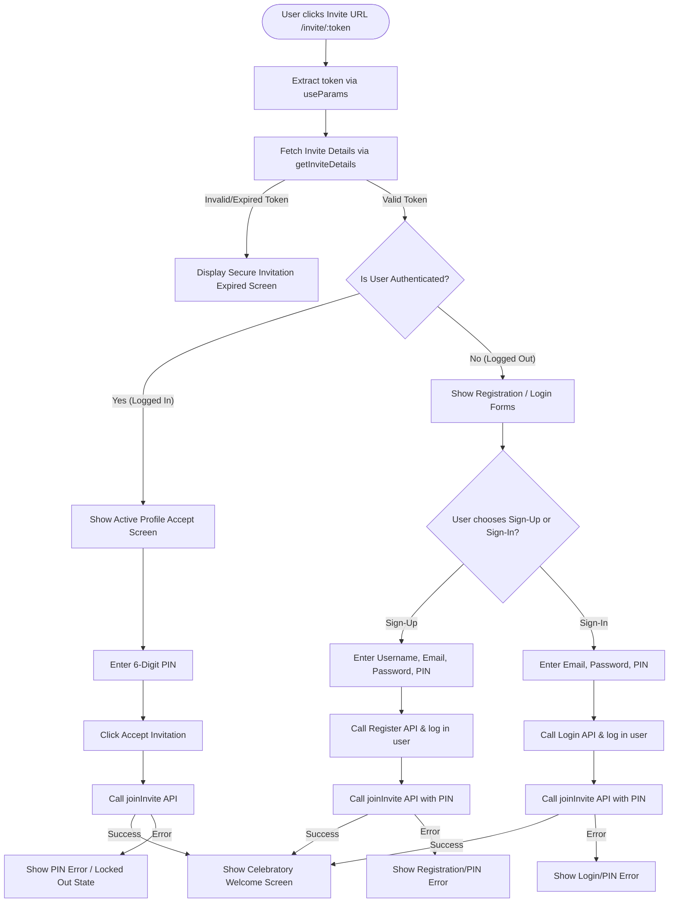

# Implementation Plan - Connect Mocked Invite Acceptance Page

This plan details the steps required to transition the **Invite Acceptance Page** ([page.tsx](file:///d:/project/hiveSpace_final/frontend/app/(public)/invite/[token]/page.tsx)) from a client-side visual simulation into a fully functional, live-integrated production page connected to the Spring Boot REST API.

## Proposed Flow

Since the Spring Boot API's `/api/i/join` endpoint requires an authenticated user context (via a Bearer token) to create the organizational memberships, we will implement a seamless, friction-free dynamic flow based on the user's authentication state:



---

## User Review Required

> [!IMPORTANT]
> **Friction-Free Joining Flow:** 
> Because invitation accepts require an authenticated session in Spring Boot, logged-out users will enter their registration/credentials *and* their invitation PIN on the same page. When they click submit, the frontend will transparently chain the operations:
> 1. Call Register/Login API to authenticate.
> 2. Initialize the authentication state using `useAuthStore`'s `login()`.
> 3. Call `joinInvite()` immediately to claim the invite space seats and join the teams.
> 4. Redirect them to `/dashboard` upon success.
> This prevents them from being redirected to a separate signup screen and losing their invitation context.

---

## Proposed Changes

### [Frontend Components & Page]

#### [MODIFY] [page.tsx](file:///d:/project/hiveSpace_final/frontend/app/(public)/invite/%5Btoken%5D/page.tsx)
- Replace all static `mockInvite` usage with dynamic API state retrieved via `getInviteDetails(token)`.
- Use the `useParams` hook from `next/navigation` to grab the active invitation token.
- Import `useAuth` hook and `useAuthStore` to access user session status (`isAuthenticated`, `user`, `login`).
- Implement real state transitions:
  - **`fetchInviteDetails`**: Mount/retrieve actual organization, workspace, team name, and inviter details. Handles bad signatures or expired link transitions immediately.
  - **`handleVerifyPIN`** (For Logged In Users): Calls `joinInvite({ token, pin })` directly.
  - **`handleRegisterAccept`** (For New Users): Chained call containing `/api/auth/register` registration followed by `joinInvite({ token, pin })`.
  - **`handleLoginAccept`** (For Existing Users): Chained call containing `/api/auth/login` followed by `joinInvite({ token, pin })`.
- Remove the temporary bottom "Demo States" debug switch since the page will now be fully dynamic and tied to real API states.

---

## Verification Plan

### Automated/Staged Testing
- Validate React & TypeScript builds cleanly via npm commands:
  ```powershell
  npm run typecheck
  ```
- Build the Next.js frontend to ensure no build-time errors:
  ```powershell
  npm run build
  ```

### Manual Verification
- We can verify the UI states manually:
  1. Generate an invite link using the settings modal.
  2. Access the link in a browser session.
  3. Validate both logged-in and logged-out flows.
