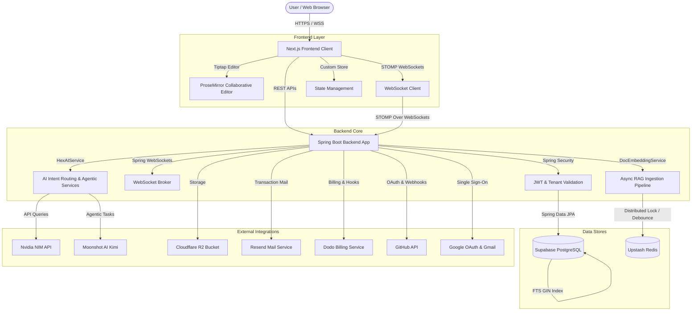
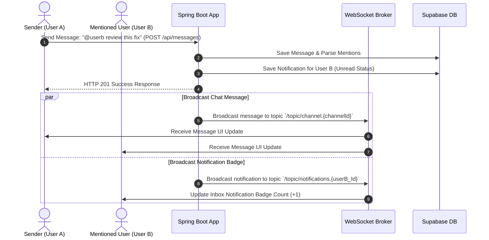
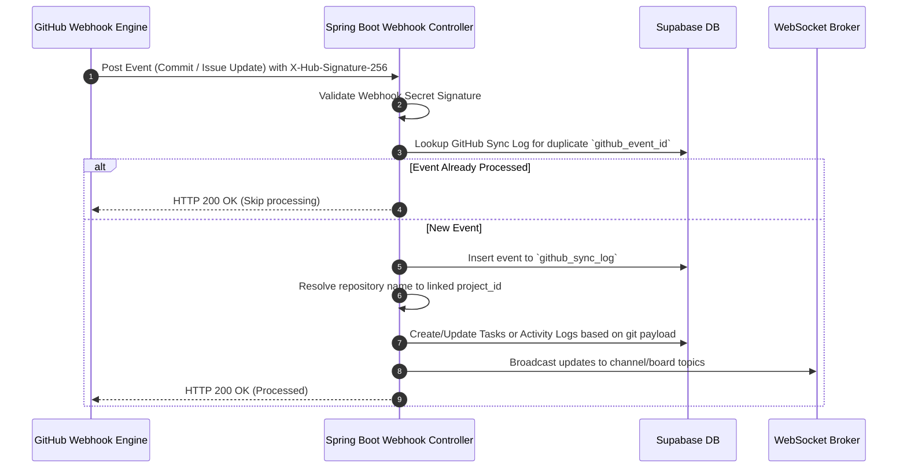

# HiveSpace System Architecture & Technical Specifications

This document provides a comprehensive, production-grade overview of the system architecture, database design, communication protocols, and external service integrations of **HiveSpace**—a multi-tenant SaaS workspace platform that integrates project management, real-time messaging, document collaboration, and advanced agentic AI/RAG services.

---

## 1. High-Level Architecture Overview

HiveSpace is structured as a decoupled client-server architecture consisting of a Next.js frontend, a Spring Boot backend, and a suite of cloud-managed data stores and third-party APIs.



---

## 2. Frontend Architecture (Next.js)

The client side is built on the React framework using **Next.js** (App Router), optimized for high information density, low latency, and aesthetic excellence.

*   **Design System & Aesthetics**: Follows the **"Digital Architect"** design philosophy (detailed in [DESIGN.md](file:///d:/project/hiveSpace_final/frontend/DESIGN.md)), emphasizing a minimalist, high-density layout.
    *   **Dark Theme ("Monolithic Depth")**: Deep base backgrounds (`#0E0E10`), near-black layering, violet gradients (`#CABEFF` to `#947DFF`), and low-contrast text for reducing eye strain.
    *   **Light Theme ("Clinical Clarity")**: White workspace (`#FFFFFF`), light gray panels (`#F7F7F8`), and sharp borders.
    *   **Grid System**: Aligned to a strict **4px/8px grid** to ensure precision layout. Boundaries are established via tonal background shifts instead of rigid 1px border lines.
*   **Editor Layer**: Implements the **HivespaceEditor** using **Tiptap** (ProseMirror engine). It saves content as ProseMirror JSON (`document_content.content`) for structure and exports raw text (`document_content.text_content`) for backend full-text indexing.
*   **Real-time Layer**: Utilizes a STOMP over WebSockets client to manage subscription channels for chat, thread replies, typing indicators, and document synchronization badges.
*   **State & Pages**: Implements a dedicated Next.js App Router workspace hierarchy:
    *   `/dashboard/projects/[projectSlug]/board` - Interactive Kanban task board with drag-and-drop.
    *   `/dashboard/chat/[channel]` - Interactive chat channels, DM rooms, and thread panels.
    *   `/dashboard/ai` - Unified Hex AI conversation interface.
    *   `/dashboard/docs` - Workspace knowledge graph and document editor.
    *   `/dashboard/github` & `/dashboard/mail` - Integrated integrations tabs.

---

## 3. Backend Architecture (Spring Boot)

The server is a multi-tenant Spring Boot Java application designed for enterprise scalability.

*   **Multi-Tenancy Isolation Strategy**: Operates a **single-database, shared-schema** tenant isolation model. Data is separated logically via a `tenant_id` column. The backend intercepts requests, resolves the current workspace context, and applies database filtering at the repository level.
*   **Spring Security & JWT**: Leverages stateless JWT authentication. The server issues a token upon Google OAuth or standard password sign-in. The token encapsulates claims about the User's identities and the Tenant context.
*   **WebSocket Controller Layer**: Uses standard Spring STOMP messaging brokers. Client clients subscribe to sub-channels:
    *   `/topic/channel.{channelId}` - Broad messages, reactions, and deletions.
    *   `/topic/thread.{messageId}` - Thread replies.
    *   `/topic/typing.{channelId}` - Active typing indicators.
    *   `/topic/document.{documentId}` - Document sync state changes (`SYNCING`, `READY`, `FAILED`).

---

## 4. Database Schema & Data Models

The relational models are structured in PostgreSQL (hosted on Supabase) to represent real-world organizational collaboration.

```
Tenant (Company/Org)
 ├── Users (Belong to a Tenant)
 ├── Tenant Members (Roles: OWNER, ADMIN, BILLING_ADMIN, MEMBER)
 ├── Workspaces (Sub-compartments of a Tenant)
 │    ├── Workspace Members (Roles: ADMIN, MEMBER, VIEWER)
 │    ├── Teams (Workspace Groups)
 │    │    └── Team Members (Roles: LEAD, MEMBER)
 │    ├── Projects (Goal-oriented deliverables)
 │    │    ├── Project Members (Roles: LEAD, MEMBER, VIEWER)
 │    │    ├── Sprints (Time-boxed iterations)
 │    │    └── Tasks (Actionable items)
 │    │         ├── Task Assignees (Roles: OWNER, COLLABORATOR, REVIEWER)
 │    │         ├── Task Activities (Audit logs)
 │    │         └── Task Embeddings (4096-dim vector representation)
 │    ├── Channels (Public, Private, DM, Thread chat rooms)
 │    │    ├── Channel Members (Read-tracking, pins)
 │    │    └── Messages (Text, File, System, AI messages with soft-delete tombstones)
 │    │         └── Message Reactions (Emojis)
 │    └── Documents (Knowledge Base)
 │         ├── Document Content (ProseMirror JSON + text content)
 │         ├── Document Versions (Historical snapshots)
 │         ├── Document Links (Knowledge Graph connections)
 │         └── Document Chunks (4096-dim vector chunks for RAG)
 └── Subscriptions (Dodo billing connection)
```

### Key Schema Characteristics
1.  **pgvector Integration**: Stores embedding vectors of size `4096` dimensions in `document_chunks.embedding` and `task_embeddings.embedding` using the Cosine distance operator (`<=>`).
2.  **Full-Text Search (FTS)**: Incorporates a GIN index on generated columns:
    ```sql
    content_tsv tsvector GENERATED ALWAYS AS (to_tsvector('english', content)) STORED;
    ```
3.  **Active Sprint Constraint**: Guarantees business logic integrity by restricting a project to only one active sprint:
    ```sql
    CREATE UNIQUE INDEX idx_one_active_sprint_per_project ON sprints (project_id) WHERE status = 'ACTIVE';
    ```
4.  **Optimized Indexes**: Explicit indexes are established on hot paths such as active messages listing:
    ```sql
    CREATE INDEX idx_messages_channel_active ON messages(channel_id, created_at DESC) WHERE deleted_at IS NULL;
    ```

---

## 5. Retrieval-Augmented Generation (RAG) & AI Pipeline

HiveSpace features an advanced RAG engine powered by **Nvidia NIM APIs** and **Upstash Redis** designed to deliver context-grounded intelligence.

### 5.1 Asynchronous Document Sync & Ingestion
Whenever a document is created or modified, the backend initiates ingestion asynchronously:
1.  **Debouncing**: The document edit events are debounced for `3 seconds` via Upstash Redis (`embed-pending:<documentId>`). This prevents redundant, heavy API updates during rapid keystrokes.
2.  **Distributed Lock**: Before processing chunks, a Redis distributed lock is acquired (`embed-lock:<documentId>`) via `SET NX EX 30` to avoid race conditions.
3.  **WebSocket Broadcast**: The system broadcasts a `"SYNCING"` status to the frontend.
4.  **Text Chunking**: The raw document text is chunked using an overlap sliding window algorithm: chunk size of **450 words** with **50 words** overlap.
5.  **Vector Embeddings**: Sends the chunk to the Nvidia NIM Embedding API (`nvidia/nv-embedcode-7b-v1`) to compute a **4096-dimension vector**.
6.  **Database Persistence**: Deletes stale chunks and saves the new vector records to `document_chunks` table.
7.  **Finalize**: Releases the lock and broadcasts `"READY"` status.

### 5.2 Hybrid Search & Retrieval Flow
When a user asks a question, the hybrid search engine integrates both Dense (Semantic) and Sparse (Keyword) query matching:
1.  **Dense Retrieval**: Generates query embeddings with Nvidia NIM API (configured as `input_type="query"`). Queries PostgreSQL via `pgvector` Cosine Similarity:
    ```sql
    SELECT * FROM document_chunks WHERE project_id = :projectId ORDER BY embedding <=> :queryVector LIMIT :limit
    ```
2.  **Sparse Retrieval**: Performs PostgreSQL FTS query search over the GIN indexed columns:
    ```sql
    SELECT * FROM document_chunks WHERE project_id = :projectId AND content_tsv @@ plainto_tsquery('english', :query) LIMIT :limit
    ```
3.  **Reciprocal Rank Fusion (RRF)**: Merges dense and sparse search rankings mathematically:
    $$\text{Score} = \frac{1}{60 + \text{Rank}_{\text{vector}}} + \frac{1}{60 + \text{Rank}_{\text{keyword}}}$$
4.  **Re-ranking Phase**: Sends the query and top candidates to the Nvidia NIM Rerank API (`nv-rerank-qa-mistral-4b:1`). This outputs raw logit scores which are used to sort candidates descending.
5.  **LLM Generation**: Appends context chunks, chat history, and system instructions to build a unified prompt. Requests chat completion via `meta/llama-3.3-70b-instruct`.
6.  **Safety Filter**: Invokes Nvidia Content Safety NIM (`nvidia/nemotron-3.5-content-safety`) to flag and filter harmful outputs before returning the response to the user.

### 5.3 Workspace AI Routing (HexAIService)
The platform houses a centralized dashboard assistant powered by `HexAIService` which utilizes a fast classifier to route requests:
*   `CONVERSATIONAL` $\rightarrow$ Routes casual small talk to LLM directly (system prompt optimized for workspace assistant).
*   `RAG_QUERY` $\rightarrow$ Triggers HybridSearch + Reranker over documents and team chats.
*   `ACTION` $\rightarrow$ Routes to specialized backend agents:
    *   **Task Generation (`AiTaskGeneratorService`)**: Automates task lists generation based on project requirements.
    *   **Triage (`AiTriageService`)**: Analyzes backlog tasks, prioritizes them based on blockers, deadlines, and history.
    *   **Sprint Retro (`AiRetroService`)**: Processes sprint completion logs to draft retroactive performance reviews.
    *   **Duplicate Detector (`AiDuplicateDetectorService`)**: Uses task vector similarity lookup to flag duplicate tasks in the backlog.

---

## 6. External Service Integrations

HiveSpace relies on high-tier infrastructure integrations to power critical SaaS operations.

| External Service | Technical Role & Usage in HiveSpace |
| :--- | :--- |
| **Supabase** | Hosts the primary PostgreSQL database. Supports UUID generation, pgvector extension for AI embeddings, and text search dictionaries. |
| **Upstash Redis** | Used for rate limiting, state caching, task-embedding debouncing (3s), and distributed locks. |
| **Cloudflare R2** | Standard S3-compatible object storage. Handles user avatars, project attachments, and message files. |
| **Resend** | Manages outgoing transactional emails, workspace invitations, and password reset notifications. |
| **Dodo** | Controls payment flows and checkout sessions. Listens to Dodo webhooks to sync workspace billing limits (`seat_count`, subscription `status`) with tenant subscriptions. |
| **Nvidia NIM APIs** | Core ML host. Powers embeddings (`nv-embedcode-7b-v1`), Reranker (`nv-rerank-qa-mistral-4b:1`), chat generation (`llama-3.3-70b-instruct`), and safety (`nemotron-3.5-content-safety`). |
| **Moonshot AI (Kimi)**| Agentic workspace LLM. Powering task creation agents, status update agents (`KimiAIService`), and workspace refactoring prompts. |
| **Cloudflare Turnstile**| Embedded client-side verification to protect authentication routes against bots and brute force attacks without annoying CAPTCHAs. |
| **Google OAuth** | SSO integration. Provides Google Sign-In for user authentication, matching incoming emails to active user rows. |
| **Gmail API** | Syncs workspace email threads and logs conversations to the dashboard inbox. |
| **GitHub Integration** | Connects projects directly to repositories. Receives GitHub webhooks for commit messages, branches, and issues. Keeps a sync log (`github_sync_log`) to prevent circular updates. Access tokens are encrypted at rest via AES-256 (`GITHUB_ENCRYPTION_KEY`). |

---

## 7. Operational Workflow Sequences

### 7.1 Real-Time Chat & Notification Mention Pipeline


### 7.2 GitHub Sync Webhook Flow

